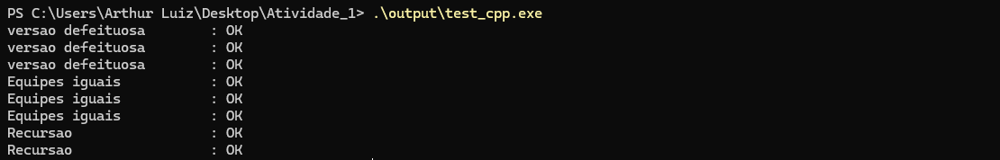

# Estruturas de Dados - IMD0029
# Autor: Arthur Luiz Rosado Alves
# Professor: João Guilherme

Repositório para a **Atividade 1** .  

---

##  Sumário
1. [Compilação e Testes](#c1)  
2. [Funções Implementadas](#c2)  
3. [Estrutura do Repositório](#c3)  
4. [Link do Repositório](#c4)  

---

# 1. Compilação e Testes
## Compilação
###  Via PowerShell
Compile com:
powershell
g++ -Wall -Wextra -g3 -Iinclude_cpp src_cpp/*.cpp test_cpp/test_algorithms.cpp -o output/test_cpp.exe

Execute: 
.\output\test_cpp.exe
Exemplo de saida:

Alternativamente, usando Makefile

make test_cpp

2. Funções Implementadas

## busca_binaria

Arquivo: src_cpp/busca_binaria.cpp
Cabeçalho: include_cpp/busca_binaria.hpp
Descrição: Implementa a busca binária para encontrar um elemento em vetores ordenados.

Parâmetros:
int n → número total de versões
int alvo → elemento procurado

Retorno: primeira versão defeituosa encontrada

Complexidade: Θ(log n)

## Busca Sequencial Ordenada 

Arquivo: src_cpp/busca_seq_ordenada.cpp
Cabeçalho: include_cpp/busca_seq_ordenada.hpp

Descrição: Implementa a busca sequencial adaptada para vetores ordenados.

Parâmetros:
const std::vector<int>& arr → vetor ordenado
int alvo → elemento procurado

Retorno: índice do elemento se encontrado, ou -1 caso contrário.

Complexidade: Θ(n)

## Recursão 
recursao

Arquivo: src_cpp/recursao.cpp
Cabeçalho: include_cpp/recursao.hpp

Descrição: Função recursiva que percorre uma string contando quantas vezes um caractere aparece.

Parâmetros:
const char* str → string de entrada
char chave → caractere a ser contado

Retorno: número de ocorrências do caractere na string.

Complexidade: Θ(n)

3. Estrutura do Repositório
Atividade_1/
├── include_cpp/        # Arquivos de cabeçalho (.hpp)
│   ├── busca_binaria.hpp
│   ├── busca_seq_ordenada.hpp
│   └── recursao.hpp
│
├── src_cpp/            # Implementações (.cpp)
│   ├── busca_binaria.cpp
│   ├── busca_seq_ordenada.cpp
│   └── recursao.cpp
│
├── test_cpp/           # Arquivos de teste
│   └── test_algorithms.cpp
│
├── output/             # Executáveis gerados
│   └── test_cpp.exe
│
├── Makefile            # Automação da compilação
├── IMD0029 - Atividade Prática.pdf   # Relatório teórico
└── prints/             # Capturas de tela da execução dos testes

4. Link do Repositório

https://github.com/aarthurrosado/Atividade_1

